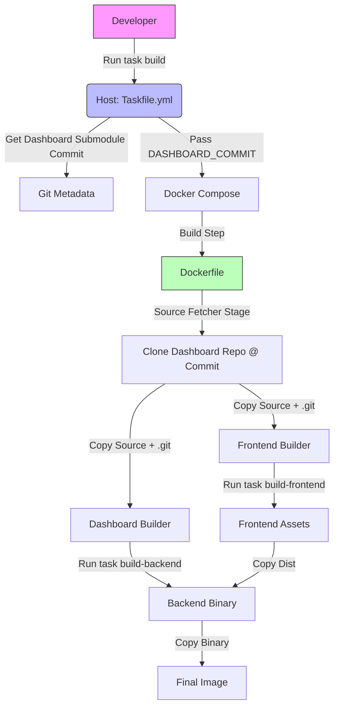

# urfd-docker

Docker build environment for the Universal Multi-protocol Digital Voice Reflector (`urfd`) and the Transcoder (`tcd`), along with various vocoder libraries and the `urfd-nng-dashboard`.

## Overview

This repository provides a multi-stage Dockerfile that compiles and packages:

1. **imbe_vocoder** (software IMBE vocoder)
2. **md380_vocoder_dynarmic** (software AMBE vocoder emulator)
3. **tcd** (Transcoder)
4. **urfd** (Universal Reflector)
5. **urfd-nng-dashboard** (Web Dashboard - Frontend & Backend)

The final image is based on **Ubuntu 24.04** and includes all necessary runtime libraries.

## Prerequisites

- **Docker**
- **Go-Task** (for orchestrating the build on host)
  - Host machine installation:

        ```bash
        sh -c "$(curl --location https://taskfile.dev/install.sh)" -- -d -b /usr/local/bin
        ```

## Directory Structure

```text
urfd-docker/           <-- You are here
├── imbe_vocoder/      (submodule)
├── md380_vocoder_dynarmic/ (submodule)
├── tcd/               (submodule)
├── urfd/              (submodule)
├── urfd-nng-dashboard/ (submodule)
├── Dockerfile
├── Taskfile.yml       <-- Entry point
├── docker-compose.yml
├── tcd.mk
└── README.md
```

## Setup

Initialize submodules:

```bash
git clone --recurse-submodules https://github.com/dbehnke/urfd-docker.git
cd urfd-docker
```

Or if already cloned:

```bash
git submodule update --init --recursive
```

## Build Process

We use a **Taskfile** to orchestrate the build. This ensures that the Docker image is built with the correct versioning information derived from the `urfd-nng-dashboard` submodule.



### Building the Image

Run the build task from the root of the repository:

```bash
task build
```

This will:

1. Verify/Retrieve the git commit of the currently checked-out `urfd-nng-dashboard` submodule.
2. Pass this commit hash to Docker as a build argument.
3. Execute `docker compose build`.

## Running the Stack

To start the services (urfd, tcd, and dashboard):

```bash
task up
```

To stop:

```bash
task down
```

### Configuration

Configuration files are expected in the `./config` directory. The `docker-compose.yml` mounts this directory to the containers.

## Development Notes

The build process for the dashboard employs a "source-fetcher" strategy. Even though we have the submodule checked out locally, we clone the repository again inside the Docker container at the specific commit hash. This ensures that the build context inside Docker has a valid `.git` directory, which is required for the `task build` commands to generate accurate version strings (`git describe`).
