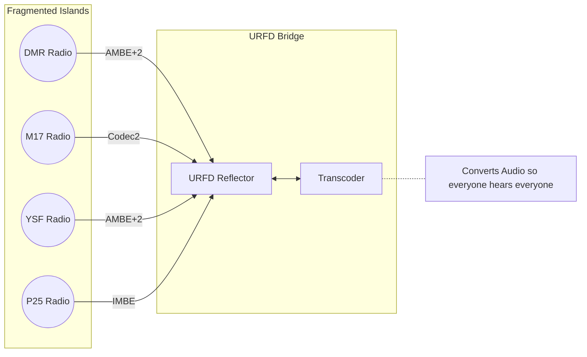
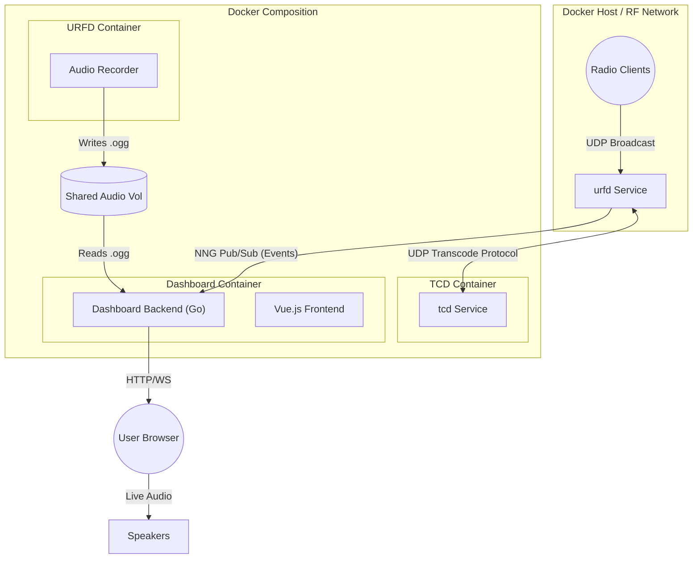
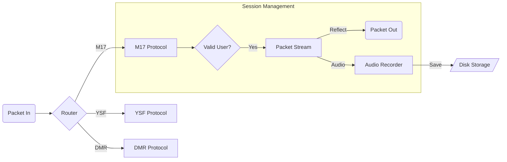
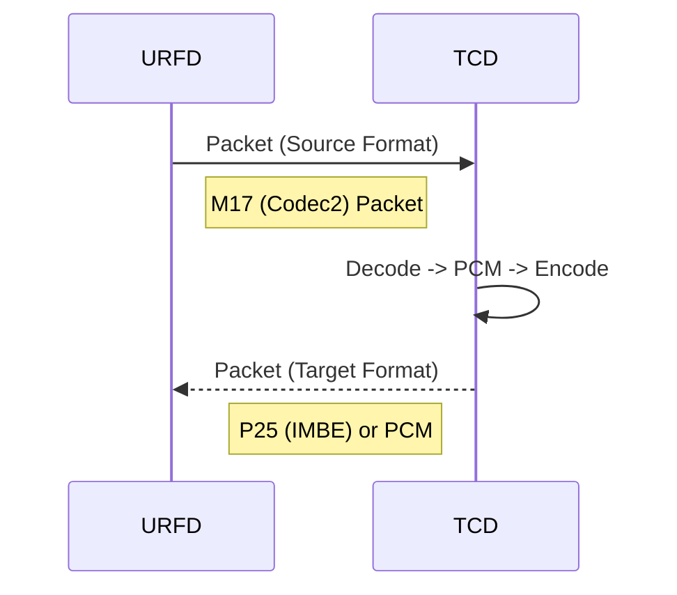
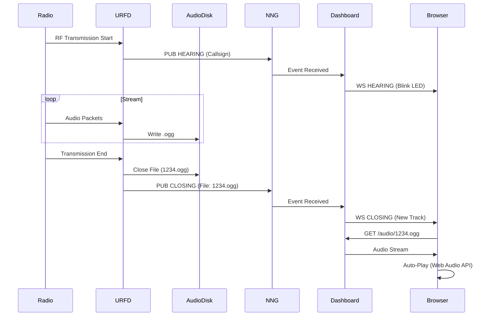

# System Architecture Overview

This document provides a high-level overview of the **URFD (Universal Reflector for Digital)** system, including its internal architecture, transcoding subsystem, messaging layer, and dashboard integration.

## 1. The Problem: Digital Mode Fragmentation

In the world of Digital Amateur Radio, operators are often siloed into mutually exclusive ecosystems based on their radio hardware:

* **DMR (Digital Mobile Radio)**: Uses AMBE+2 codec. Popular but complex.
* **System Fusion (YSF)**: Uses AMBE+2, specific to Yaesu radios.
* **D-Star**: Uses AMBE, specific to Icom/Kenwood.
* **P25 / NXDN**: Public safety standards, incompatible with others.
* **M17**: A new, open-source mode using the Codec2 vocoder.

### The "Walled Garden"

Without a bridge, a user on a **DMR** radio cannot talk to a user on an **M17** radio. They speak different "languages" (Vocoders) and use different transport protocols.

### The Solution: Universal Reflector (URFD)

URFD acts as a **Universal Translator and Meeting Point**.

* **Multiprotocol Support**: It accepts connections from all major modes.
* **Transcoding**: It converts audio in real-time (e.g., Codec2 <-> AMBE).
* **Unified Dashboard**: It provides a single view of all activity, regardless of the source mode.

<!-- break list -->



---

## 2. High-Level Architecture

The system is composed of three primary services running in Docker containers:

1. **urfd**: The core reflector application (C++) handling radio protocols.
2. **tcd**: The transcoder application (C++) converting audio codecs (e.g., M17 Codec2 <-> P25 IMBE).
3. **dashboard**: The web interface (Go/Vue.js) for monitoring and playback.

They communicate via:

* **NNG (Nanomsg Next Gen)**: IPC/TCP messaging for events (Hearings, Closings).
* **UDP / Host Networking**: Radio packet exchange and transcoding data.
* **Shared Volume**: Access to recorded audio files.

<!-- break list -->



---

## 3. URFD Internal Architecture

**URFD** is the central hub. It listens for incoming transmission packets from gateways (Hotspots, Repeaters) across multiple protocols (M17, DMR, P25, YSF, NXDN).

### Core Components

* **Reflector**: The main orchestrator (`CReflector`). Manages streams and routing.
* **protocols**: Specialized handlers for each mode (e.g., `M17Protocol`, `YSFProtocol`).
* **PacketStream**: Manages the buffer of packets for a specific transmission.
* **AudioRecorder**: Captures decoded/transcoded audio and writes to disk.

<!-- break list -->



```

---

## 4. Transcoding (TCD)

**TCD** is a specialized service for converting vocoder formats. URFD offloads this CPU-intensive task to a dedicated process.

### Hybrid Transcoding Engine

TCD utilizes the best available method for each codec:

1. **Hardware Transcoding (AMBE Chipsets)**:
    * Used for proprietary codecs like **AMBE+2** (found in DMR, YSF, P25 Phase 2) and **IMBE** (P25 Phase 1).
    * Interfaces with **DVSI USB Dongles** (e.g., ThumbDV).
    * Offloads processing to the dedicated hardware, ensuring legal compliance and low CPU usage.

2. **Software Transcoding**:
    * **M17 (Codec2)**: Fully open-source, handled natively in software via the `codec2` library.
    * **Software AMBE**: Supports software-based decoding (via `md380_vocoder`) when hardware is unavailable, for compatible modes.

**Flow**: URFD receives a packet (e.g., M17) -> Sends to TCD -> TCD converts (Software Decode -> Hardware Encode) -> Returns packet (e.g., DMR) -> URFD processes it.

<!-- break list -->



---

## 5. NNG Messaging & Audio Pipeline

We replaced custom TCP sockets with **NNG (Nanomsg Next Gen)** for robust, zero-mq style messaging.

### Event Bus

URFD publishes events to the dashboard.

* **HEARING**: A transmission has started. Contains Callsign, Module, Talkgroup.
* **CLOSING**: A transmission has ended. Contains Duration and associated **Audio Filename**.

### Recording & Playback Flow

1. **Capture**: `AudioRecorder` in URFD writes Opus-encoded packets to an Ogg container on the shared volume.
2. **Notification**: On transmission end, URFD fires a `CLOSING` event via NNG referencing the filename.
3. **Indexing**: Dashboard backend receives the event and updates its in-memory "Last Heard" list.
4. **Playback**:
    * **Live Mode**: Dashboard Frontend receives WebSocket event -> Auto-plays the new file.
    * **History**: User clicks "Play" -> Dashboard serves file from shared volume.

<!-- break list -->


